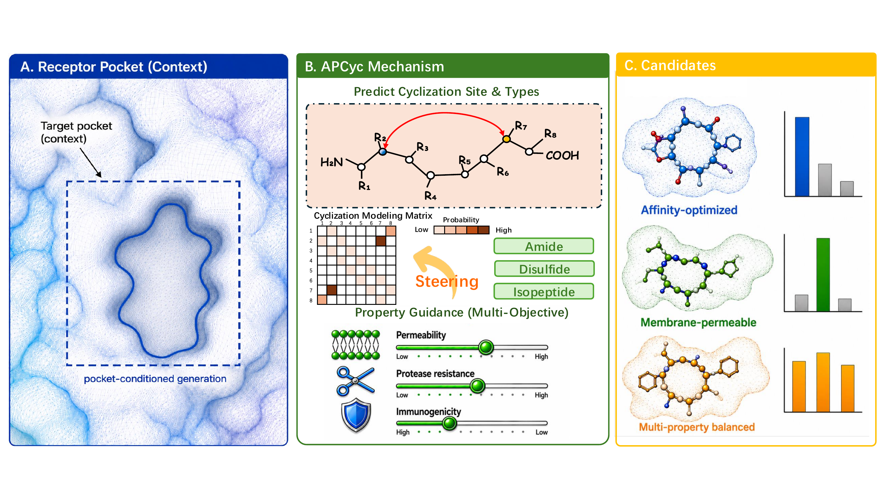

# APCyc

Project website for **APCyc: Property-Informed Design of Cyclic Peptides via Automated Cyclization**.

[Live website](https://qiaoqian-fan0214.github.io/APCyc/) |
[Paper PDF](https://qiaoqian-fan0214.github.io/APCyc/assets/apcyc/paper.pdf) |
[DOI](https://doi.org/10.1145/3770855.3818908)



## Overview

APCyc is a target-aware latent diffusion framework for automated cyclization and property-informed cyclic peptide design. The project page presents the method overview, cyclization-topology injection module, denoising demos, experimental results, case studies, and citation information for the KDD 2026 paper.

## Website Contents

- Overview of the APCyc design problem and key contributions
- Method figures for sampling, topology injection, and property guidance
- Denoising trajectory videos for target-aware cyclic peptide generation
- Therapeutic and generative metric comparisons
- Case studies, ablations, dataset summary, and BibTeX citation

## Repository Structure

```text
.
|-- .github/workflows/pages.yml    # GitHub Pages deployment workflow
|-- public/assets/apcyc/           # Figures, paper PDF, and demo videos
|-- src/routes/index.tsx           # Main project page content
|-- src/static-main.tsx            # Static Vite entry for GitHub Pages
|-- src/styles.css                 # Tailwind and site styling
|-- vite.config.ts                 # Lovable/TanStack Start config
`-- vite.pages.config.ts           # Static GitHub Pages build config
```

## Local Development

Install dependencies:

```bash
npm install
```

Start the development server:

```bash
npm run dev
```

Build the static GitHub Pages version locally:

```bash
npm run build:pages
```

Preview the static build:

```bash
npm run preview:pages
```

To build with the same base path used on GitHub Pages:

```bash
GITHUB_PAGES=true npm run build:pages
```

## Deployment

The site is deployed with GitHub Actions from the `main` branch. Any push to `main` runs `.github/workflows/pages.yml`, builds the static site with:

```bash
GITHUB_PAGES=true npm run build:pages
```

and publishes the output from `dist/` to GitHub Pages.

Production URL:

```text
https://qiaoqian-fan0214.github.io/APCyc/
```

## Citation

```bibtex
@inproceedings{zhao2026apcyc,
  title={APCyc: Property-Informed Design of Cyclic Peptides via Automated Cyclization},
  author={Zhao, Yifan and Qin, Lang and Chen, Jintai},
  booktitle={Proceedings of the 32nd ACM SIGKDD Conference on Knowledge Discovery and Data Mining V.2},
  year={2026},
  address={Jeju Island, Republic of Korea},
  publisher={ACM},
  doi={10.1145/3770855.3818908}
}
```

## Authors

Yifan Zhao, Lang Qin, and Jintai Chen  
The Hong Kong University of Science and Technology (Guangzhou)
